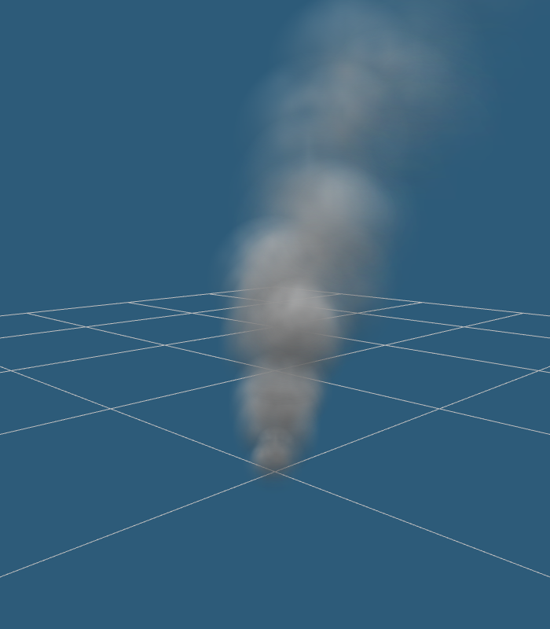

# CurlySmoke
Smoke particles with a curly effect near the edges of the smoke column. The effect is achieved by rotating and mirroring the smoke noise along the vertical axis.

[Runs in a browser!](jobtalle.com/CurlySmoke)

